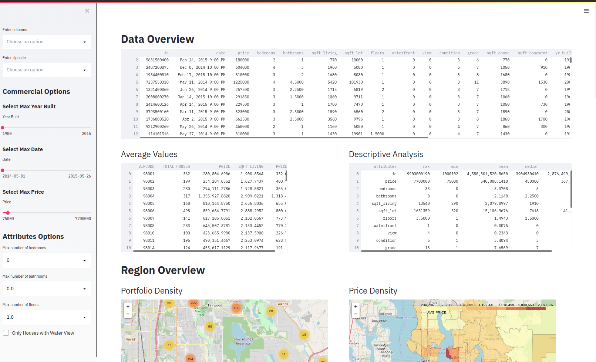
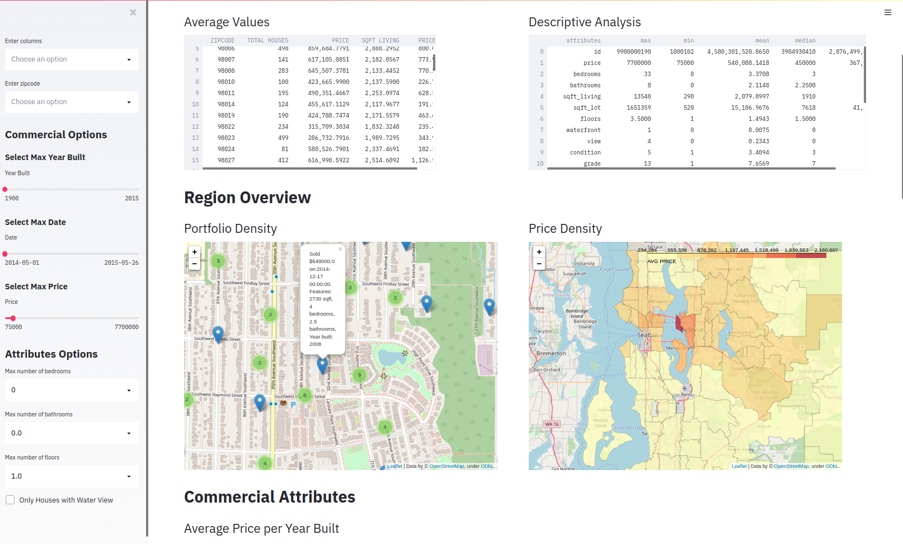

# House Rocket Analytics

Este projeto se trata de uma simulação sobre ciência de dados em uma empresa do ramo imobiliário. Como resultado do projeto, resolvemos alguns problemas de gerenciamentos de informações, e conseguimos aumentar a margem de lucro da empresa em um total de 19.89%.

## 1. Sobre o Projeto
### 1.1 Problema de Negócio
A House Rocket é uma empresa (fictícia) do setor imobiliário, que tem como modelo de negocio a compra e venda de imoveis localizados em King County - USA, sendo o resultado dessa operação o lucro da empresa.

A House Rocket enfrenta alguns problemas, eles tem um grande conjunto de dados mas não conseguiram tirar muitas informações. Abaixo segue uma lista dos principais problemas que eles enfrentam:
- Precisam fazer algumas analises por conta própria.
- Não aproveitam todo o potencial do conjunto de dados, como a descoberta de insights.
- Eles não sabem quais casas devem comprar e vender, e qual o valor.

### 1.2 Data Overview
| Attribute | Description |
| :----- | :----- |
| id | Código de identificação de cada imóvel |
| date | Data de inserção do imóvel na base |
| price | Preço pedido pelo imóvel |
| bedrooms | Número de quartos |
| bathrooms | Número de banheiros |
| sqft_living | Área construída |
| sqft_lot | Área do terreno |
| floors | Número de andares |
| waterfront | Variável binária indicando se o imóvel tem vista para o mar |
| view | Uma escala de 0 a 4 indicando a qualidade da vista do imóvel |
| condition | Uma escala de 0 a 5 indicando as condições do imóvel |
| grade | Uma escala de 1 a 13 indicando a qualidade da construção e padrão arquitetônico |
| sqft_above | Área construída acima do solo |
| sqft_basement | Área construída do porão |
| yr_built | Ano de construção do imóvel |
| yr_renovated | Ano da última reforma |
| zipcode | Código postal do imóvel |
| lat | Latitude |
| long | Longitude |
| sqft_living15 | Área construída dos 15 vizinhos mais próximos |
| sqft_lot15 | Área do terreno dos 15 vizinhos mais próximos |

[Dataset from Kaggle](https://www.kaggle.com/harlfoxem/housesalesprediction)  

### 1.3 Solução

**1.3.1 Aplicação para analises:** Uma aplicação no heroku. Um dashboard interativo, onde se e possível fazer suas próprias analises.

&nbsp;

&nbsp;

[House Rocket App](https://dados-house-rocket.herokuapp.com/)

**1.3.2 Insights:** Os insights gerados pela visualizacao de dados, estao na imagem abaixo. Ou para uma melhor visualizacao recomendo ver os insights no arquivo do jupyter notebook.

 [House Rocket Jupyter Notebook Codes](https://github.com/jlcunha/House-Rocket/blob/main/house_rocket.ipynb)

**1.3.3 Compra e vendas de imoveis:** Um relatório com os imoveis a serem comprados, e o valor a serem vendidos. Os imoveis serão selecionados pelas seguintes condições:
- O valor dos pés quadrados do imóvel tem de estar abaixo da mediana, do valor dos pés quadrados da sua região (zipcode).
- Condição dos imoveis tem de estar igual ou acima de 3.

O relatório pode ser acessado aqui: [casas_para_compra.csv](https://github.com/jlcunha/House-Rocket/blob/main/casas_para_compra.csv)

**1.4.4. Resultado Financeiro das Recomendações:** O custo de todos os imoveis a serem comprados é de $ 5.163.360.430 (Dólar). Caso as recomendações forem implantadas, o potencial total do lucro obtido com as vendas recomendadas sera de $ 1.026.992.389 (Dólar) - 19.89% de lucro. Por se tratar de um valor alto, eu recomendo que se inicie a operação, com as casas que tem como nível de condições e de vista acima ou igual a 4. Elas são as melhores casas, com melhor visual, sendo assim mais fácil de fazer campanhas de marketing, e consequentemente mais fáceis de vender. Gerando receita de forma acelerada.

## 2. Tecnologias Utilizadas
- Python 3
- Pycharm
- Jupyter Notebook
- Streamlit
- Heroku Cloud

## 3. Arquivos do projeto
 [House Rocket Jupyter Notebook Codes](https://github.com/jlcunha/House-Rocket/blob/main/house_rocket.ipynb)
 
  [Arquivos do herokuapp](https://github.com/jlcunha/House-Rocket/tree/main/HerokuApp)

## 4. Próximos passos
- Projetar e executar testes para isolar causas e efeitos
- Recomendar mudanças nas táticas ou gastos para melhorar os resultados
- Identificar grupos e subgrupos de clientes e prospectos

## 5. Agradecimentos
Este projeto é um exercício do curso *Python: do zero ao Data Scientist* - [Comunidade DS](https://www.comunidadedatascience.com/comunidade-ds/).

## 6. Contato
Projeto criado por [Lucas da Cunha](https://www.linkedin.com/in/jose-lucas-da-cunha-28688a22a?lipi=urn%3Ali%3Apage%3Ad_flagship3_profile_view_base_contact_details%3BS5kKyD%2BtTFWX2hvXam0x7g%3D%3D)

Data Scientist em formação

[Portfolio de Projetos](https://jlcunha.github.io/portfolio_projetos/)

[Linked In](http://www.linkedin.com/in/lucas-dacunha/)
