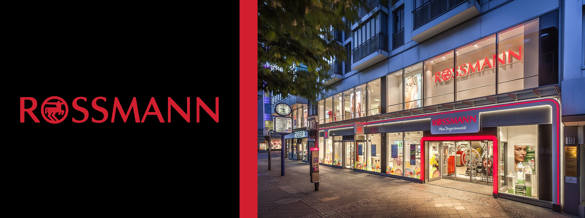

# Rossmann Sales Forecasting

**Note:** This project is for educational purposes.

---

## 1 - Business Problems

### 1.1 - About Rossmann
Rossmann is one of the largest drugstore chains in Europe, employing around 56,200 staff and operating over 4,000 stores.  
Founded in 1972 by Dirk Rossmann, the company is headquartered in Burgwedel near Hanover, Germany. Its product range includes up to 21,700 items, varying depending on the store's size and location.

### 1.2 - The Problem
Rossmann's CFO has decided to renovate the stores. To plan the budget for each renovation, he has requested a revenue forecast for each store over the next six weeks. To solve this problem, we will use past sales data.

### 1.3 - About the Data

| Attribute                  | Description                                                                                     |
|----------------------------|-------------------------------------------------------------------------------------------------|
| ID                         | Generated from Store + Date                                                                    |
| Store                      | Unique ID for each store                                                                       |
| Sales                      | Volume of sales made on that day                                                               |
| Customers                  | Total number of customers in the store that day                                                |
| Open                       | Indicator of whether the store was open: 0 = closed, 1 = open                                  |
| State Holiday              | Indicates state holiday: a = public holiday, b = Easter holiday, c = Christmas, 0 = None       |
| School Holiday             | Indicates closure of public schools                                                            |
| Store Type                 | Describes one of four different store models: a, b, c, d                                       |
| Assortment                 | Describes the assortment level: a = basic, b = extra, c = extended                             |
| Competition Distance       | Distance in meters to the nearest competitor                                                   |
| Competition Open Since     | Approximate month and year the nearest competitor opened                                       |
| Promo                      | Indicates if the store was running a promotion that day                                        |
| Promo2                     | Continuous and consecutive promotion for some stores: 0 = not participating, 1 = participating |
| Promo2 Since               | Year and calendar week when the store started participating in Promo2                          |
| Promo Interval             | Consecutive months when Promo2 begins. For example: "February, May, August, November"          |

Data source: [Kaggle](https://www.kaggle.com/competitions/rossmann-store-sales/data)

---

## 2 - Business Assumptions
* NA values in `CompetitionDistance` were replaced with 200,000 meters, indicating no competitors within this radius.
* Missing values in `Competition Open Since` were filled using data from the `Date` column.
* For `Promo2Since`, NA values were also replaced with data from the `Date` column.

---

## 3 - Solution Strategy
CRISP-DM (Cross-Industry Standard Process for Data Mining) is the foundation for this project. Once the initial CRISP cycle is complete, additional iterations can create new features, generate insights, and improve model performance. Ongoing communication with stakeholders is critical for alignment and setting expectations.

---

## 3.1 - Data Description
* Columns renamed using snake_case.
* Checked dataset size (rows and columns) to ensure local feasibility.
* Verified and adjusted column data types.
* Addressed missing data (if applicable).
* Performed descriptive statistics and analyzed numerical and categorical data.

---

## 3.2 - Feature Engineering
* Created a **Mind Map** to generate hypotheses and assess their impact on sales.  

**Mind Map of Hypotheses**  
  

---

## 3.3 - Filtering Variables
* Removed data for closed stores or days without sales.
* Excluded redundant columns derived during feature engineering.
* Removed the `customers` column since future customer counts are unknown.

---

## 3.4 - Exploratory Data Analysis
**Univariate Analysis:**  
* Observed sales data distribution and transformed it for normality using logarithmic scaling.  

**Bivariate Analysis:**  
* Used data visualization to validate hypotheses and assess relationships between variables.

**Multivariate Analysis:**  
* Created heatmaps for numerical variable correlations (Pearson’s method).  
* For categorical variables, calculated **Cramer’s V coefficient** to assess relationships.

---

## 3.5 - Data Preparation
* Applied rescaling techniques: `RobustScaler` for outliers, `MinMaxScaler` for near-normal distributions.
* Encoded categorical variables using One-Hot, Label, or Ordinal Encoding as needed.
* Transformed response variables using log transformations.

---

## 3.6 - Feature Selection
* Divided the dataset: training data includes all but the last 6 weeks, which are used for validation.
* Selected features using the Boruta algorithm and hypothesis analysis.

---

## 3.7 - Machine Learning Modeling
Tested five models for quick value creation:
1. Average Model  
2. Linear Regression  
3. Lasso Regression  
4. Random Forest Regression  
5. XGBoost Regression  

**Selected XGBoost** for its computational efficiency and performance similarity to Random Forest.

---

## 3.8 - Hyperparameter Tuning
Used Random Search to optimize model parameters.  

---

## 3.9 - Performance Evaluation
Evaluated models using error rates and visualized performance using sales prediction charts.

---

## 3.10 - Model Deployment
Developed a **Telegram Bot** using Flask and Heroku for real-time forecast delivery.  

---

## 4 - Conclusions
* CRISP-DM ensures rapid value delivery with potential for improvement.
* Exploratory Data Analysis validates hypotheses and provides business insights.
* Machine Learning models outperform traditional methods.

---

## 5 - Next Steps
* Introduce new features to enhance model performance.
* Develop customer traffic forecasting models.

---

## 6 - Technologies
Python, Jupyter, Pandas, Scikit-Learn, Flask, Heroku.

---

## 7 - Author

Vaishnavi Tripathi
Data Scientist

[Project Portfolio](https://ttripathi167.github.io/Portfolio/)

[GitHub Profile](https://github.com/ttripathi167/) 

