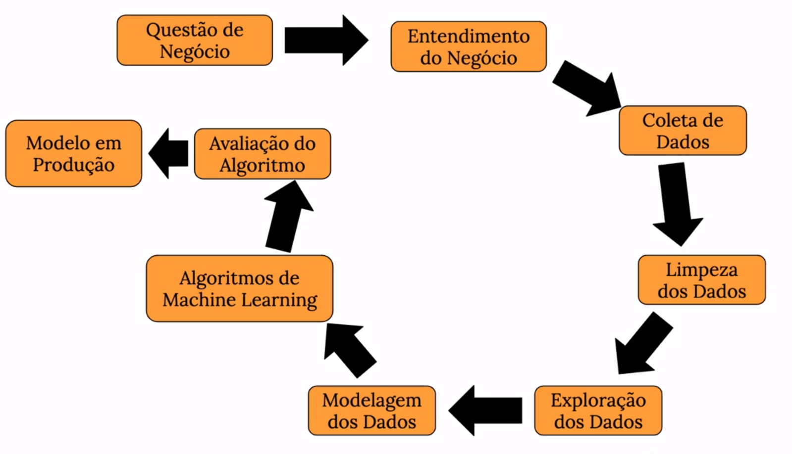
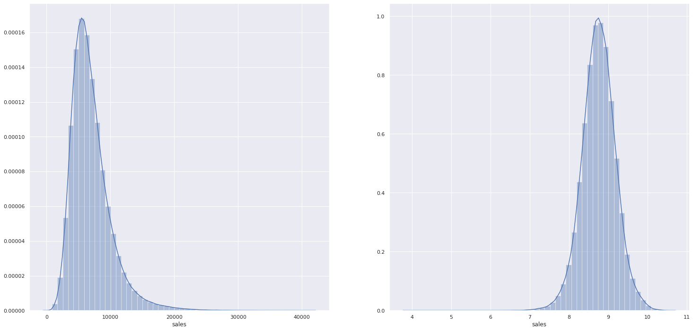
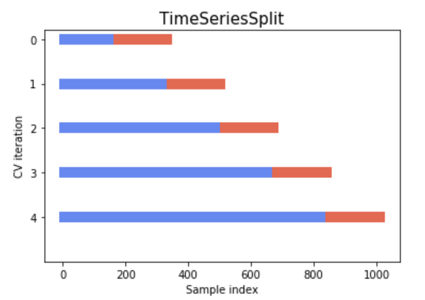
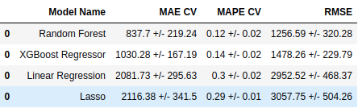
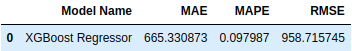
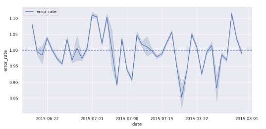
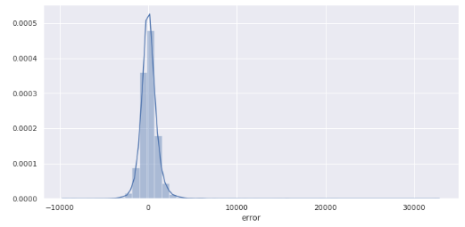
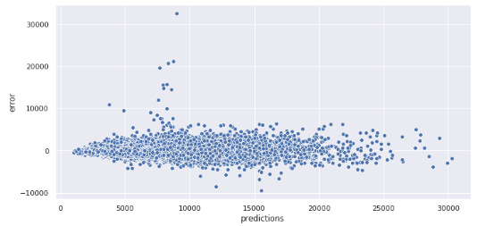
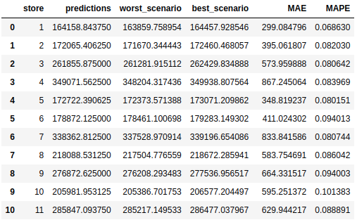

# Rossmann Sales Forecasting

**Obs:** Este projeto tem fins educacionais.

---

## 1 - Business Problems ( Problemas de Negócio )

### 1.1 - Sobre a Rossmann
A Rossmann é uma das maiores cadeias de drogarias da Europa, com cerca de 56.200 funcionários e mais de 4.000 lojas.
A empresa foi fundada em 1972 por Dirk Rossmann com sede em Burgwedel perto de Hanover na Alemanha. A gama de produtos inclui até 21.700 itens e pode variar dependendo do tamanho da loja e da localização.

### 1.2 - O Problema
O CFO da Rossmann decidiu reformar as lojas, e para planejar quanto gastar em cada reforma, ele solicitou uma previsão da receita de cada loja nas próximas seis semanas. Para resolver este problema utilizaremos os dados das vendas dos últimos anos.

### 1.3 - Sobre os dados

| Atributo | Descrição |
| :----- | :----- |
| ID | Gerado a partir do Store + Date |
| Store | Id único para cada loja |
| Sales | O volume de vendas realizadas neste dia |
| Customers | O número total de clientes na loja neste dia |
| Open | Indicador para saber se a loja estava aberta: 0 = fechada, 1 = aberta |
| State Holiday | Indica feriado estadual. a = feriado, b = feriado da Páscoa, c = Natal, 0 = Nenhum |
| School Holiday | Indica fechamento das escolas públicas |
| Store Type | Descreve um entre os 4 modelos de lojas diferentes: a, b, c, d |
| Assortment | Descreve um nível de sortimento: a = básico, b = extra, c = estendido |
| Competition Distance | Distância em metros até a loja concorrente mais próxima |
| Competition Open Since [Month/Year] | Fornece o ano e o mês aproximados em que o concorrente mais próximo foi aberto |
| Promo | Indica se uma loja está fazendo uma promoção naquele dia |
| Promo2 | A Promo2 é uma promoção contínua e consecutiva para algumas lojas: 0 = a loja não está participando, 1 = a loja está participando |
|Promo2 Since [Year/Week] | Descreve o ano e a semana do calendário em que a loja começou a participar da Promo2 |
| Promo Interval | Descreve os intervalos consecutivos em que a Promo2 é iniciada, nomeando os meses em que a promoção é iniciada novamente. Por exemplo, "fevereiro, maio, agosto, novembro" significa que cada rodada começa em fevereiro, maio, agosto, novembro de qualquer ano para essa loja |

Data source: [Kaggle](https://www.kaggle.com/competitions/rossmann-store-sales/data)

## 2 - Business Assumptions ( Premissas de Negócios )
* Na coluna CompetitionDistance os valores NA foram alterados para 200.000 metros, significando que não a competidor em um raio menor que 200.000 metros.
* Para valores NA em Competition Open Since[Month/Year], utilizamos os mesmos dados da coluna Date.
* No caso da coluna Promo2Since[Year/Week], os valores NA também foram substituídos pelo valor da coluna Date.

## 3 - Solution Strategy ( Estratégia de Solução )
CRISP-DM é a abreviação de Cross Industry Standard Process for Data Mining, que pode ser traduzido como Processo Padrão Inter-Indústrias para Mineração de Dados. É um modelo de processo de mineração de dados que descreve abordagens comumente usadas por especialistas em mineração de dados para atacar problemas.

Como base para este projeto usaremos  o CRISP, uma vez realizado todo o primeiro ciclo do CRISP, nós podemos fazer outras interações, criar novas features, gerar novos insights, melhorar a performance do modelo, tudo com objetivo de entregar mais valor para a empresa. Também é importante durante todo o processo, conversar com os interessados no projeto, a fim de mantê-los informados, e setar as expectativas.

Todos os códigos e visualizações deste projeto podem ser seguidos neste [Notebook](store_sales_prediction-final.ipynb).

### 3.1 - Data Description ( Descrição dos dados )
* As colunas foram renomeadas para snake case.
* Descobrindo qual o tamanho do conjunto de dados( linhas, colunas ). Para determinar se é possível trabalhar com ele localmente.
* Verificação dos tipos das colunas. E alterando para o tipo certo.
* Checando os valores NA. E corrigindo se possível os dados faltantes.
* Estatística Descritiva com os dados numéricos.
* Análise dos dados categóricos.

### 3.2 - Feature Engineering
* Foi criado um mapa mental para auxiliar a gerar hipóteses. Com o objetivo no centro e os atributos nas ramificações, para entender como os atributos podem impactar as vendas.

**Mind Map of Hypotheses**

* Com o mapa mental criamos uma lista de hipóteses. Com objetivo de ver quanto a hipótese tem de impacto nas vendas.
* Novas features foram criadas, com objetivo de ajudar a visualizar tendências temporais, e também para auxiliar o modelo.

### 3.3 - Filtering Variables
* Foram retirados os dias que as lojas não estavam abertas, e dias que não foram realizadas vendas.
* Foram excluídas colunas que foram derivadas em outras variáveis no feature engineering.
* A coluna de customers foi retirada, pois não temos os dados de quantos clientes vão à loja nas próximas 6 semanas. No próximo ciclo do crisp, seria interessante fazer uma previsão de quantos clientes irão para a loja nas próximas semanas. Para então fazer uma previsão de vendas.

### 3.4 - Exploratory Data Analysis
**Univariate Analysis**:
* Observando o gráfico da variável resposta, percebemos que ela está com uma skew positiva ( figura 1 ). Multiplicando a variável resposta pelo log, ela fica com uma distribuição mais parecida com uma normal ( figura 2 ).

&nbsp;

* Plot de histogramas usando as variáveis numéricas, são observados alguns comportamentos relevantes que serão usados no modelo.
* Plot de gráficos de barras e linhas sobrepostas, para observar as variáveis categóricas.

**Bivariate Analysis**:
* Validação das hipóteses  usando visualização de dados para entender a relação entre as variáveis e a variável resposta. Também com o objetivo de gerar insights.

**Multivariate Analysis**:
* Variáveis Numéricas: Plot de um heatmap com as correlações usando o método de Pearson.
* Variáveis Categóricas: Criei uma função para calcular o coeficiente de Cramer’s V em relação a duas variáveis. Depois é gerado um gráfico heatmap  com todas as combinações.
( link da fonte: [ Cramer’s V - Wikipedia ](https://en.wikipedia.org/wiki/Cram%C3%A9r%27s_V) )

### 3.5 - Data Preparation
* Selecionando as variáveis de acordo com sua distribuição e escala, neste passo temos que preparar os dados. Como no conjunto de dados da Rossmann não há nenhum caso de normalização. Seguimos para o redimensionamento( rescaling ).
* No rescaling usamos o RobustScaler para variáveis com outliers, e o MinMaxScaler para variáveis com distribuições mais próximas de normais.
* Em transformação dividimos entre 3 grupos.
* No primeiro Encoding selecionamos as variáveis categóricas e aplicamos One Hot Encoding, Label Encoding e Ordinal Encoding de acordo com cada variável.
* Em Response Variable Transformation aplicamos o log1p( log transformation ), na variável resposta. Como vimos na análise da variável resposta, no passo acima ( Exploratory Data Analysis ), aplicando essa transformação de log, a variável resposta vai ter uma distribuição perto de uma normal.
* Por último, Nature Transformation( transformação de natureza ), selecionando as variáveis temporais, aplicamos um modelo de natureza cíclica.

### 3.6 - Feature Selection
* Como o objetivo do projeto e uma previsão de vendas das próximas 6 semanas, para a validação do modelo de machine learning, a divisão do dataset será as últimas 6 semanas para a validação, e o restante para treino.
* Selecionando as colunas com o algoritmo Boruta.
* Com o resultado do Boruta, comparo a relevância das features com a análise das hipóteses no passo 4. Com as features do Boruta e da análise de hipóteses, tenho as features que usarei nesse primeiro ciclo do CRISP.

### 3.7 - Machine Learning Modeling
* Para o primeiro ciclo do CRISP serão usados 5 modelos para criarmos valor para o negócio o mais rápido possível. Outros modelos podem ser testados nos próximos ciclos do CRISP.

1. **Average Model**: Modelo de média. Ele será usado para avaliar a performance dos demais modelos.
2. **Linear Regression Model**: A regressão linear modela a relação entre variáveis ajustando uma equação linear aos dados observados.
3. **Lasso Regression Model**: Método de análise de regressão que realiza seleção e regularização de variáveis para melhorar a precisão da previsão.
4. **Random Forest Regression Model**: Algoritmo que cria uma combinação (ensemble) de árvores de decisão.
5. **XGBoost Regression model**: Algoritmo de aprendizado de máquina, baseado em árvore de decisão e que utiliza uma estrutura de Gradient boosting.

>  Os modelos lineares performaram pior que o modelo de média, isso demonstra o quão complexo são nossos dados.

* Ao construir um modelo, você precisa avaliar seu desempenho. E aqui estamos somente avaliando a performance nesse único período das 6 últimas semanas. Para uma melhor avaliação dos modelos utilizaremos um método conhecido como Cross Validation in Time Series ( Validação Cruzada em séries temporais ).

* A ideia para divisões de séries temporais é dividir o conjunto de treinamento em duas dobras a cada iteração, com a condição de que o conjunto de validação esteja sempre à frente do conjunto de treinamento. Na primeira iteração, treina-se o modelo com a primeira dobra, e usamos a dobra seguinte para validação, na segunda interação treina-se o modelo com a união da primeira e segunda dobra da primeira interação,  e usamos a dobra seguinte para validação, assim sucessivamente até o final do conjunto de treinamento.

* Você precisa repetir essas etapas até testar seu modelo em cada uma das interações e suas métricas finais serão a média das pontuações obtidas em cada dobra.Isso permite que você evite o overfitting e avalie o desempenho do modelo ao longo do tempo.

&nbsp;
* Abaixo teremos o resultado dos modelos com a aplicação do Cross Validation:
&nbsp;

> Apesar do modelo Random Forest ter o melhor resultado, o XGBosst foi escolhido para ser o modelo final, isso porque ele performa relativamente parecido com o Random Forest mas exige menos capacidade computacional. No dia a dia de um Cientista de Dados também é importante medir quanto os seus modelos gastam de capacidade computacional, para avaliar o custo para a empresa.

### 3.8 - Hyperparameter Fine Tuning
* Com o objetivo de selecionar os melhores hiperparâmetros para o modelo utilizaremos o método Random Search.
* No Random Search criamos um dicionário com alguns hiperparâmetros, e então serão treinados modelos com conjuntos desses hiperparâmetros selecionados aleatoriamente.
* Com o melhor resultado do Random Search treinamos novamente, e temos o seguinte resultado:

### 3.9 - Performance Evaluation
>  Para modelos de regressão nos avaliamos usando o erro.

 **Resultado das predições em relação às vendas ao longo das últimas 6 semanas.**

&nbsp;

 **Taxa de erro ao longo das últimas 6 semanas.**

&nbsp;

 **Distribuição do erro.**

&nbsp;

 **Previsões em relação ao erro.**

&nbsp;

* **Best and Worst Case Scenario**:
  * Foi calculado o melhor e o pior cenário para cada previsão.

> O conjunto de dados com as previsões de cenário podem ser acessados neste documento. [Predictions Scenario](data/predictions_scenario.csv)

### 3.10 - Model Deployment
* Para melhor atender o CFO da Rossmann será criado um bot no Telegram. Usando Flask e o server do Heroku construiremos o bot para ser acessado em qualquer lugar pelo CFO desde que ele tenha uma conexão com a internet.

**Arquitetura do bot**

&nbsp;

**Telegram bot**:

> Ao iniciar o chat com o bot, basta enviar o número de uma loja, que você receberá as previsões. Lembrando que no caso de não existir a loja no conjunto de dados, você receberá a mensagem "Store Not Available".

Você pode acessar o bot através desse link: [Telegram Bot](https://t.me/RossmannSalesPredictionBot)

Ou através deste QRCode:

## 4 - Conclusions ( Conclusões )
* Com o método CRISP conseguimos entregar valor o mais rápido possível para a empresa. E se precisar, podemos fazer mais ciclos para melhorar a performance do modelo.
* Com Exploratory Data Analysis ( Análise exploratória de dados ) podemos validar hipóteses, gerar insights e conhecer melhor nosso conjunto de dados. Sendo uma das etapas mais importantes do CRISP.
* Modelos de Machine Learning tem melhor performance do que os métodos tradicionais.

## 5 - Next Steps to Improve ( Próximos passos )
No próximo ciclo do CRISP podemos:
* Criar novas features com o objetivo de melhorar a performance do modelo.
* Avaliar novas hipóteses, e validar a hipótese 5.
* Criar um modelo de previsão de quantos clientes irão à loja nas próximas 6 semanas.
* Para lojas em que as previsões tiveram performances ruins, testar outros modelos e hiperparâmetros, a fim de melhorar a taxa de erro.
* Outra versão do bot do telegram, com novas funções, como mostrar pior e melhor cenário, e gráficos.

## 6 - Technologies ( Tecnologias )

## 7 - Author

Lucas da Cunha
Data Scientist em formação

[Portfolio de Projetos](https://jlcunha.github.io/portfolio_projetos/)

[GitHub Profile](https://github.com/jlcunha/)

[Linked In](http://www.linkedin.com/in/lucas-dacunha/)
