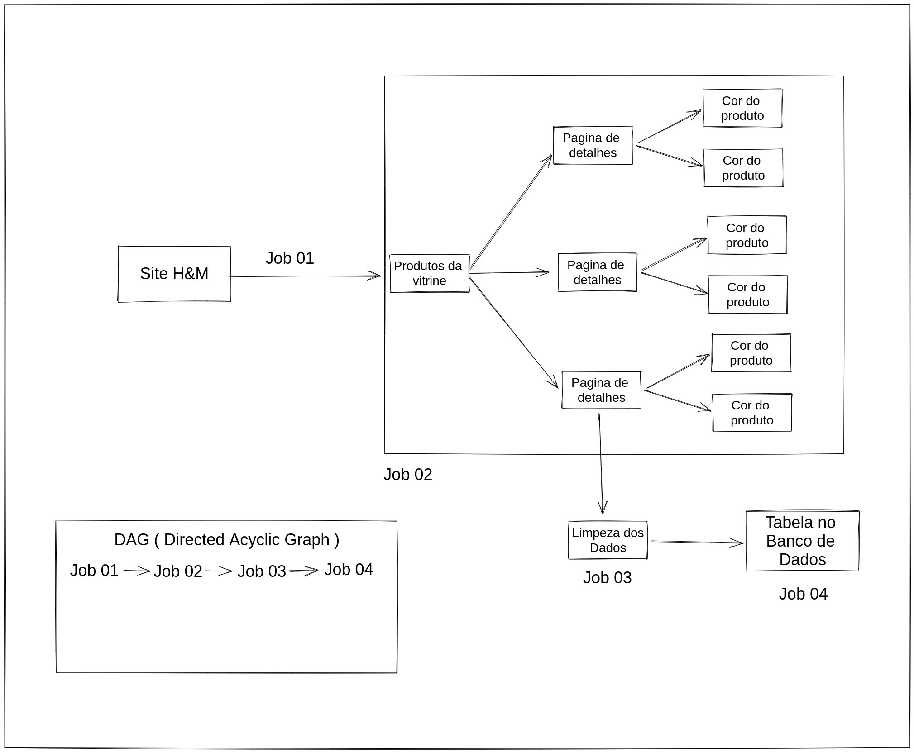
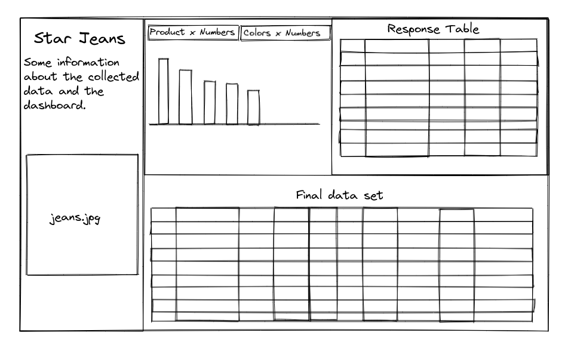
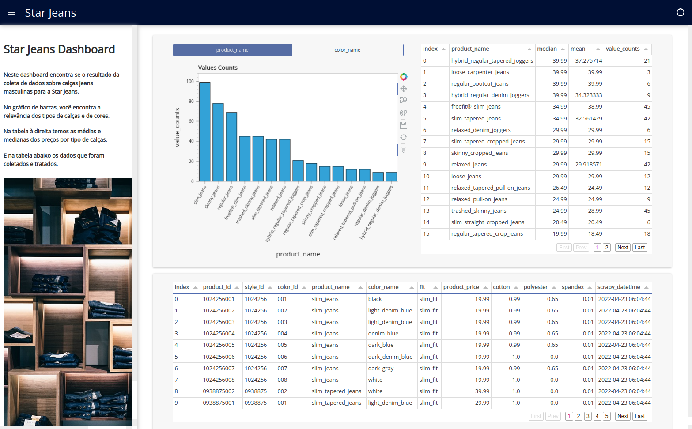

# Welcome to the Star Jeans Data Analysis

## 1 - Business Problem

Eduardo e Marcelo são dois brasileiros, amigos e sócios de empreendimentos. Depois de vários negócios bem sucedidos, eles estão planejando entrar no mercado de moda dos USA como um modelo de negócio do tipo E-commerce.

A ideia inicial é entrar no mercado com apenas um produto e para um público específico, no caso o produto seria calças Jeans para o público masculino. O objetivo é manter o custo de operação baixo e escalar à medida que forem conseguindo clientes.

Porém, mesmo com o produto de entrada e a audiência definidos, os dois sócios não têm experiência nesse mercado de moda e portanto não sabem definir coisas básicas como preço, o tipo de calça e o material para a fabricação de cada peça.

Assim, os dois sócios contrataram uma consultoria de Ciência de Dados para responder às seguintes perguntas:

1. Qual o melhor preço de venda para as calças?
2. Quantos tipos de calças e suas cores para o produto inicial?
3. Quais as matérias-primas necessárias para confeccionar as calças?

## 2 - Data Overview

| Attribute | Description |
| :----- | :----- |
| product_id | Id único para cada produto. |
| style_id | Id único para cada estilo. |
| color_id | Id único para cada cor. |
| product_name | Nome do produto. |
| color_name | Nome da cor. |
| fit | Formato do Jeans. |
| product_price | Preço do produto. |
| cotton | Porcentagem de Cotton na calça. |
| polyester | Porcentagem de Poliéster na calça. |
| spandex | Porcentagem de Spandex na calça. |
| scrapy_datetime | Data em que foi feita a coleta. |

> **Os dados foram coletados através do site da H&M( Hennes&Mauritz - uma das maiores empresas no segmento de roupas ).**

Link do Website: [H&M Website](https://www2.hm.com/en_us/men/products/jeans.html)

## 3 - Solution Strategy

**3.1 Data Collection:** Fazer web scraping do website da H&M( processo de coleta de dados estruturados da web de maneira automatizada ). Para o web scraping estarei utilizando a biblioteca Beautiful Soup.

Link da biblioteca: [BeautifulSoup](https://www.crummy.com/software/BeautifulSoup/bs4/doc/)

**3.2 Data Cleaning:**  Nesta etapa utilizaremos Regex( Expressão regular, ou Regex, são padrões utilizados para identificar determinadas combinações ou cadeias de caracteres em uma string ) e outras técnicas para separar, corrigir e limpar os dados coletados

**3.3 ETL Design:** ETL, do inglês Extract Transform Load (Extrair Transformar Carregar), é um processo estruturado de extração de dados de diversos sistemas, transformação desses dados conforme regras de negócios e por fim o carregamento dos dados para Data WareHouse( depósito de dados ).

* Projetar a arquitetura do ETL.

* Ordenar as dependências entre os jobs( trabalhos). Os jobs tem uma certa ordem para acontecer, pois a jobs que dependem de outros.

* Com o Cron( agendador de tarefas ) agendaremos e executaremos automaticamente os jobs. Ele é executado em segundo plano e permite a automatização do ETL, para que não tenhamos que rodar ele manualmente.

* Foi criado um sistema de Logs para registrar eventos relevantes. Esse registro pode ser utilizado para monitorar o comportamento do ETL. Com o Log poderemos visualizar se houve algum problema e onde foi esse problema. Ex: Se houver uma quebra na coleta de dados descobriremos em qual produto ele parou.

&nbsp;

**3.4 Database Creation:** Com os dados coletados é criado uma tabela em SQLite.

**3.5 Data Analysis:** Análise estatistica para cada atributo dos dados coletados.

**3.6 Data Visualization:** Com os dados são criados graficos em relação aos principais problemas de negócio, a fim de ter um melhor entendimento dos dados.

**3.7 Create Dashboard:** Usando a biblioteca panel foi criado um dashboard com os resultados do projeto.

## 4 - Business Results

**4.1 - Mediana dos preços dos produtos mais populares:**

| Index | Product | Price (US$) |
| :-----: | :-----: | :-----: |
| 1 | Slim Jeans | 19.99 |
| 2 | Skinny Jeans | 19.99 |
| 3 | Regular Jeans | 19.99 |
| 4 | Freefit® Slim Jeans | 34.99 |
| 5 | Trashed Skinny Jeans | 24.99 |

**4.2 - Cores mais populares:**

| Index | Color |
| :-----: | :----- |
| 1 | Denim Blue |
| 2 | Light Denim Blue |
| 3 | Black |
| 4 | Dark Denim Blue |
| 5 | Dark Gray |

**4.3 - Dashboard Final:**

Notebook com o dashboard: [Notebook](final_data_analysis_dashboard.ipynb)

## 5 - Conclusions

Você já deve ter ouvido falar que “Dados são o novo petróleo”, com web scraping nós temos acesso aos dados. Com os dados coletados podemos monitorar as tendências de mercado, coletar informações para captação de novos clientes, fazer previsões e muitas outras coisas.

Mas os dados brutos não são fáceis de se interpretar, por isso temos o ETL, para que depois da extração, realizar o tratamento desses dados, para poder extrair informações que vão ajudar nas futuras tomadas de decisões e depois temos que carregar esses dados, para que todos na empresa tenham acesso a essas novas informações. Assim a empresa tem algo concreto para tomar as suas decisões, e não apenas contar com a intuição dos tomadores de decisões.

## 6 - Next Steps to Improve

* Coletar informações sobre os tamanhos.
* Coletar informações de outros competidores.
* Coletar os dados por um período maior com objetivo de ter informações sobre a sazonalidade.

## 7 - Technologies

## 8 - Author

Lucas da Cunha

Data Scientist em formação

[Portfolio de Projetos](https://jlcunha.github.io/portfolio_projetos/)

[GitHub Profile](https://github.com/jlcunha/)

[Linked In](http://www.linkedin.com/in/lucas-dacunha/)
